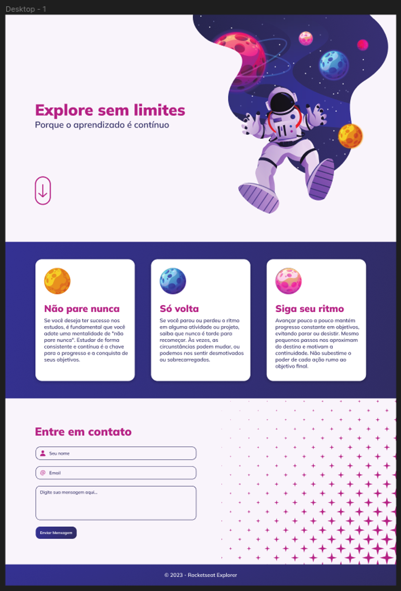

<h1 align="center"> Explore sem limites </h1>

Este desafio faz parte de um intensivão dos stages 01 ao 04.

Pontos importantes que foram pensados durante a construção desse projeto:

- Regra do mobile first, como você pode ver, no layout do Figma, já temos a aplicação responsiva também;
- Animações, transições e transformações;
- Unidades de medida flexíveis (rem);
- Variáveis no CSS;
- Acessibilidade.  

## 🚀 Tecnologias

Esse projeto foi desenvolvido com as seguintes tecnologias:

- HTML e CSS
- Git e Github
- Figma

## 💻 Projeto

Explore sem limites

## 🔖 Layout

Você pode visualizar o layout do projeto através [DESSE LINK] (https://www.figma.com/file/lnwkDn8iNwmWtxqRmDgPIl/Explore-sem-limites-(Copy)?node-id=0%3A1&mode=dev). É necessário ter conta no [Figma] (https://figma.com) para acessá-lo.

## :memo: Licença

Esse projeto está sob a licença MIT.

---

Feito com ♥ by Rocketseat :wave: [Participe da nossa comunidade!] (https://discord.gg/rocketseat)

---

Esse projeto foi realizado pela aluna Kássia Almeida Moura em 2024.

# Desafio-Explore-sem-limites
